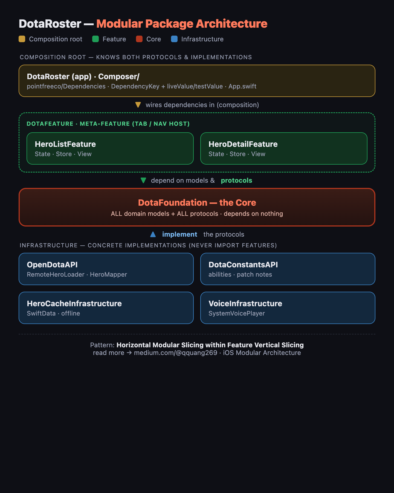
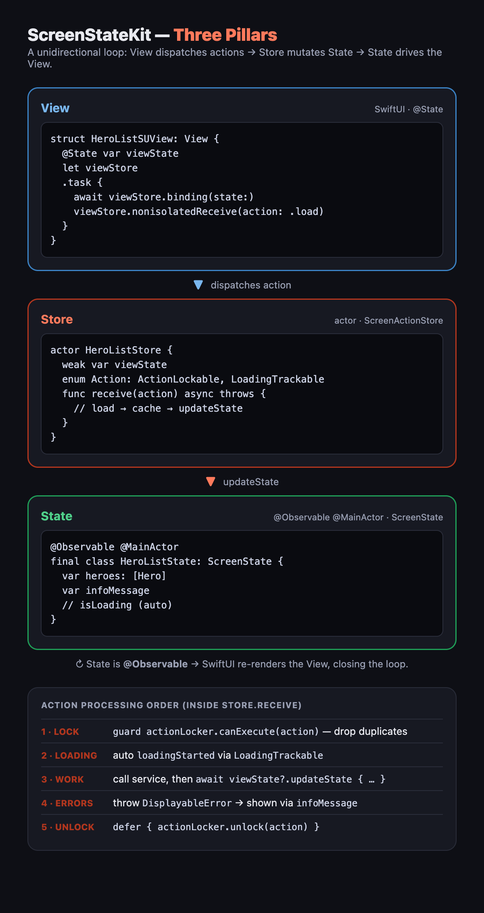

# DotaRoster

[](https://github.com/anthony1810/DotaRoster/actions/workflows/ci.yml)
[](https://github.com/anthony1810/DotaRoster/actions/workflows/test-modules.yml)
[](https://github.com/anthony1810/DotaRoster/actions/workflows/testflight.yml)

A Dota 2 hero browser for iOS — browse every hero, see their info, and tap to hear their voice lines. Built as the **reference sample app for [ScreenStateKit](https://github.com/anthony1810/ScreenStateKit)**, demonstrating the *Three Pillars* state pattern inside a modular, protocol-driven clean architecture.

> Supersedes **Definery** as the canonical ScreenStateKit example. It mirrors the **OnDeck** layout: a single `DotaFoundation` core, role-based infrastructure packages, feature-as-package modules, and `pointfreeco/Dependencies` for dependency injection.

**Stack:** iOS 26+ / macOS 26+ · SwiftUI · **Swift 6** (full language mode) · SwiftData · ScreenStateKit · Swift Testing.

---

## Modular Architecture

The app is split into small Swift packages, each with one job.



> 📖 This applies **Horizontal Modular Slicing within Feature Vertical Slicing** — see the write-up: [iOS Modular Architecture: From Monolith to Hybrid Approaches](https://medium.com/@qquang269/ios-modular-architecture-from-monolith-to-hybrid-approaches-979f827886fb).

**The governing rule: every dependency points inward, to `DotaFoundation`.** Features and infrastructure are *siblings that never import each other* — a feature depends on a **protocol**, and only the app's composition root knows the concrete implementation. That inversion is what makes features testable without a network or database, infrastructure swappable, and packages buildable in isolation.

| Package | Layer | Role |
|---|---|---|
| `DotaFoundation` | Core | All domain models + all service protocols. Zero outward dependencies. |
| `OpenDotaAPI` | Infrastructure | HTTP loaders for `api.opendota.com` (`RemoteHeroLoader`, `HeroMapper`). |
| `DotaConstantsAPI` | Infrastructure | Abilities + patch notes from `odota/dotaconstants`. |
| `HeroCacheInfrastructure` | Infrastructure | SwiftData persistence → offline-first hero list. |
| `VoiceInfrastructure` | Infrastructure | `SystemVoicePlayer` — speaks hero lines. |
| `HeroListFeature` | Feature | Hero grid — `HeroListState` / `HeroListStore` / `HeroListSUView`. |
| `HeroDetailFeature` | Feature | Hero detail + voice. |
| `DotaFeature` | Meta-feature | Hosts the features in tabs / navigation. |
| `DotaRoster` (app) | Composition root | Binds concrete infra to protocols and assembles each screen. |

### How a feature is composed

1. **`DotaFoundation`** declares the contract — a domain model + a protocol:
   ```swift
   public protocol HeroLoaderProtocol: Sendable {
       func loadHeroes() async throws -> [Hero]
   }
   ```
2. **Infrastructure** fulfils it independently — `RemoteHeroLoader` (`OpenDotaAPI`) and `SwiftDataHeroStore` (`HeroCacheInfrastructure`).
3. **The feature** builds the screen against the *abstraction* — `HeroListStore` holds `any HeroLoaderProtocol` and imports only `DotaFoundation` + `ScreenStateKit`.
4. **The Composer** binds the concrete type to the protocol and assembles the screen:
   ```swift
   extension HeroLoaderKey {
       static var liveValue: any HeroLoaderProtocol { RemoteHeroLoader(client: URLSessionHTTPClient()) }
   }

   enum HeroListComposer {
       @MainActor static func makeView() -> HeroListSUView {
           @Dependency(HeroLoaderKey.self) var loader
           @Dependency(HeroStoreKey.self) var store
           return HeroListSUView(viewState: HeroListState(),
                                 viewStore: HeroListStore(loader: loader, store: store))
       }
   }
   ```
5. **Tests** swap `liveValue` for a `LockIsolated` spy — the same store runs with no network or database.

---

## ScreenStateKit Architecture

Every screen is a unidirectional loop built from three pillars.



- **State** — `@Observable @MainActor final class … : ScreenState`. Holds the screen's data plus `infoMessage`; `isLoading` is tracked automatically. Being `@Observable`, mutating it re-renders the View.
- **Store** — `actor … : ScreenActionStore`. Holds a `weak` reference to the State, defines an `Action` enum, and processes actions in `receive(action:)`.
- **View** — SwiftUI. Binds to the Store in `.task` and dispatches actions; never touches services directly.

```swift
// 1 · State
@Observable @MainActor
final class HeroListState: ScreenState, StateUpdatable {
    var heroes: [Hero] = []
    var infoMessage: InfoPresenterType?
}

// 2 · Store
actor HeroListStore: ScreenActionStore {
    private(set) weak var viewState: HeroListState?
    private let actionLocker = ActionLocker.nonIsolated
    enum Action: ActionLockable, LoadingTrackable, Hashable, Sendable { case load, refresh }

    func binding(state: HeroListState) { viewState = state }

    func receive(action: Action) async throws {
        guard actionLocker.canExecute(action) else { return }   // dedupe
        defer { actionLocker.unlock(action) }
        let heroes = try await loader.loadHeroes()
        try? await store.save(heroes)
        await viewState?.updateState { $0.heroes = heroes }      // mutate → View re-renders
    }
}

// 3 · View
struct HeroListSUView: View {
    @State private var viewState: HeroListState
    let viewStore: HeroListStore

    var body: some View {
        grid
            .task {
                await viewStore.binding(state: viewState)
                viewStore.nonisolatedReceive(action: .load)
            }
            .presentProgress(isLoading: viewState.isLoading)
            .presentMessage($viewState.infoMessage)
    }
}
```

**Action processing order** (every action, inside `receive`): `actionLocker.canExecute` → auto `loadingStarted` → do the work + `updateState` → `throw DisplayableError` on failure → `defer { actionLocker.unlock }`.

---

## Data sources

| Purpose | Source | Endpoint |
|---|---|---|
| Hero list + base stats | OpenDota | `api.opendota.com/api/heroes` |
| Win/pick rates | OpenDota | `api.opendota.com/api/heroStats` |
| Hero portraits | Valve CDN | `cdn.cloudflare.steamstatic.com/.../heroes/{slug}.png` |
| Abilities + patch notes | odota/dotaconstants | `raw.githubusercontent.com/odota/dotaconstants/master/build/*.json` |

Voice lines are spoken via on-device text-to-speech; `HeroLine.audioURL` is the seam for real audio later.

> ⚠️ Hero art, voice audio, and ability media are Valve intellectual property — fine for personal/portfolio/learning use, not for App Store publication.

## Requirements & running

- Xcode 26+, iOS 26+ simulator or device. Open `DotaRoster.xcodeproj`, select the **DotaRoster** scheme, and run — SPM resolves all dependencies automatically.

## Roadmap

**Refactor (layered + tested + offline-first):**
`P0` structure ✅ → `P1` DotaFoundation ✅ → `P2` OpenDotaAPI → `P3` cache → `P4` voice → `P5` Hero List → `P6` Hero Detail → `P7` composition → `P8` test plans + CI.

**Future features:** hero skills/abilities · win-rate & pick stats · patch notes ("What's New") · per-hero skill changes · skill demo video & real voice lines.

## CI/CD

- **PR → `develop`** runs the build/test workflow (`macos-26`, Xcode 26.2).
- **Merge → `main`** archives and uploads to TestFlight.

## Credits

State management by **[ScreenStateKit](https://github.com/anthony1810/ScreenStateKit)**. Hero data from **[OpenDota](https://www.opendota.com/)** and **[odota/dotaconstants](https://github.com/odota/dotaconstants)**. Dota 2 is a trademark of Valve Corporation; this is an unofficial, non-commercial project.
